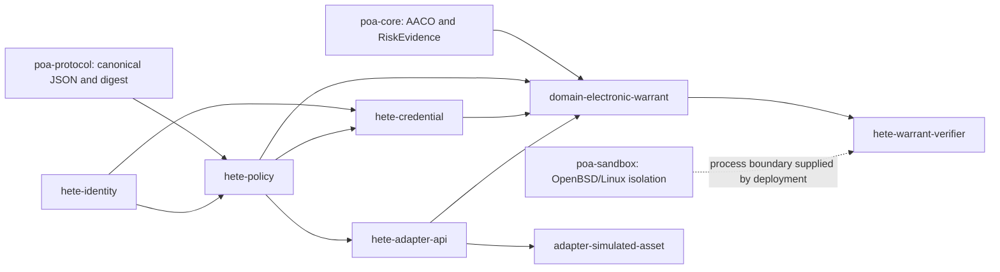
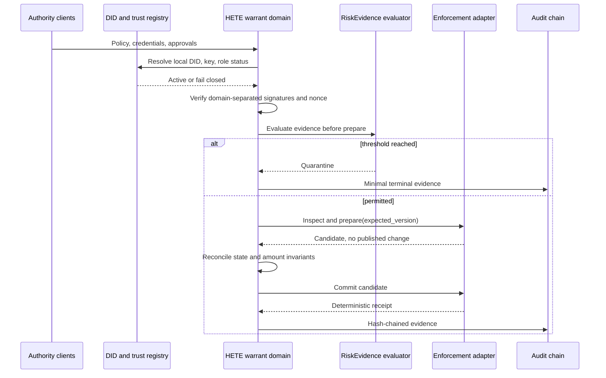
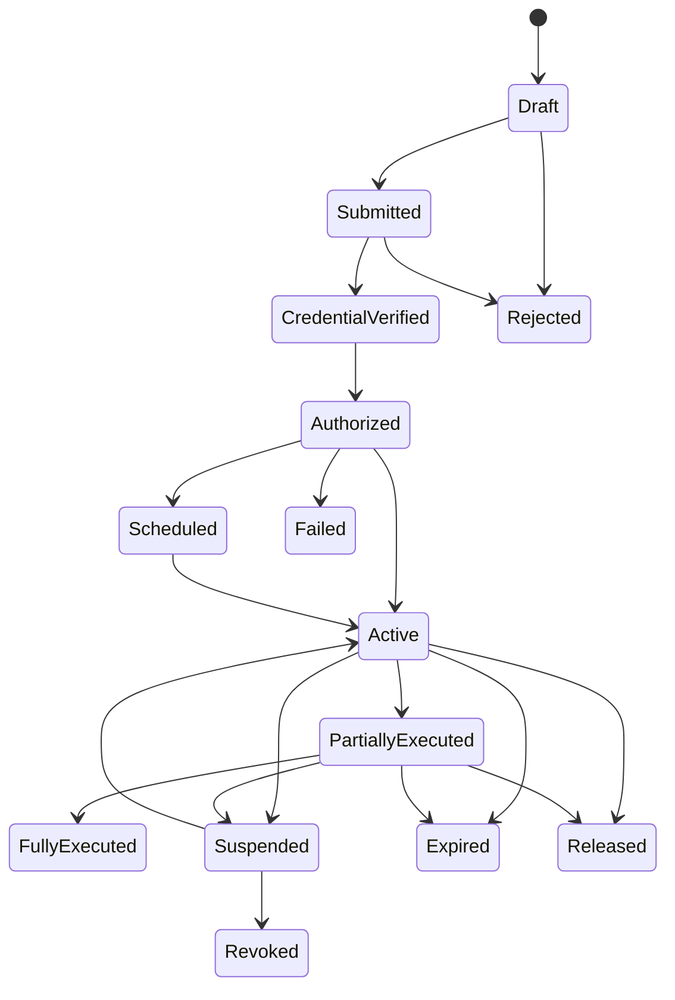

# HETE Electronic Warrant Reference Architecture

## Scope

This clean-room implementation turns the prior Voting-coupled electronic-warrant concept into a platform-neutral policy-enforcement reference domain. It imports no source or Cargo dependency from `hete`, `voting-common`, voter management, tally, or reward escrow.

The work-order proposed a linear dependency diagram placing identity/credential/policy under the POA crates. The repository implementation instead uses a directed acyclic graph: `hete-policy` depends on the neutral identity types, credential depends on identity and policy, the warrant domain depends on those foundations plus `poa-core`, and concrete adapters remain behind `hete-adapter-api`. This preserves domain neutrality and avoids cyclic dependencies.

## Trust-boundary execution

## Warrant lifecycle

Terminal resurrection is rejected. Risk quarantine maps to `Suspended` without adapter prepare/commit.

## Public commitment and confidential ingress

Public two-phase mode registers only `(policy_digest, nonce, expiry)`. It prevents equivocation and detects replay but neither identifies nor locks a hidden target. Reveal performs the actual policy-aware adapter enforcement. `ConfidentialIngress` defines the boundary for an external private transport; the included local sealed-envelope implementation records `simulation-only` assurance and makes no cryptographic confidentiality claim.

## OpenBSD deployment boundary

The existing `poa-sandbox` startup ordering remains unchanged: configuration validation, resource preparation, listener acquisition, `unveil`, `pledge`, lock, then request processing. The warrant domain does not contain OS policy terms. Ubuntu uses the existing non-production backend for development evidence; OpenBSD 7.9 native evidence remains a separate runner and no SSH connection secret is copied into results or reports.

## Failure behavior

- Schema, digest, role, key, nonce, domain, capability, amount, expiry, and state errors reject before commit.
- Risk evidence may quarantine before candidate mutation.
- Prepare/commit infrastructure failures abort; simulated commit failure leaves state unchanged.
- Optimistic version conflict rejects stale candidates.
- Audit evidence contains only pseudonymous actor references and state digests; it never contains raw credentials or plaintext subject identifiers.

## Applicability

The reference covers HETE-aware regulated assets, policy-hook-enabled accounts/tokens/vaults, and the deterministic simulated ledger. It does not implement universal account freezing, consensus/mempool ordering control, or a finished legal service.
