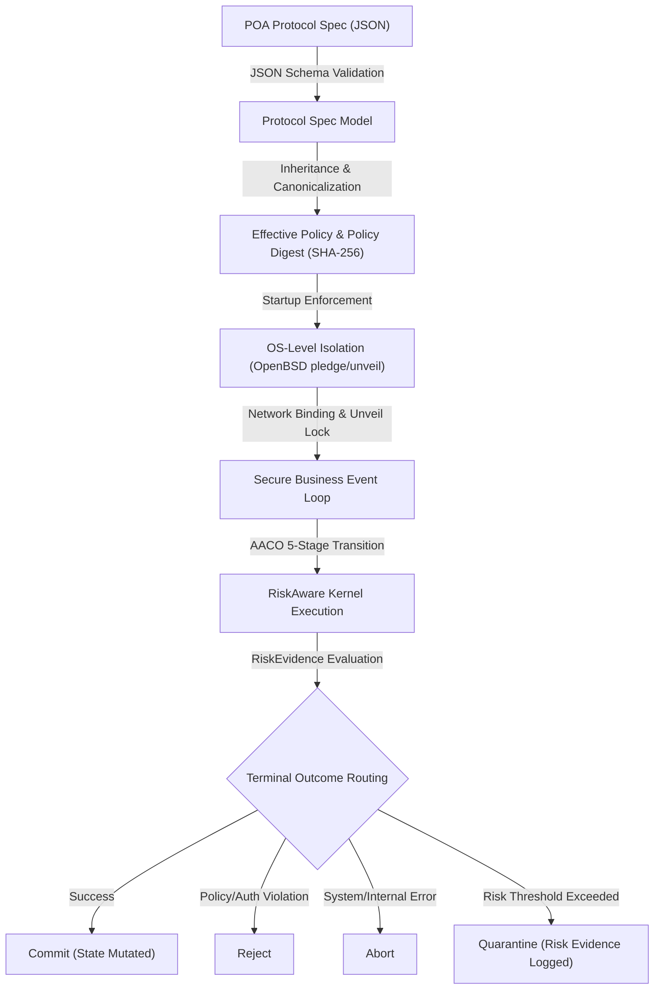

# hete_sandbox Architecture & Source Structure Report

**Paper Context**: *"From Access Trust to Process Trust: A Protocol-Oriented Architecture for Invariant-Constrained Execution"*  
**Repository Name**: `hete_sandbox`  
**Purpose**: Reference Implementation and Evaluation Sandbox for Process Trust Architecture (POA)  
**Target Path**: [docs/architecture/ARCHITECTURE_REPORT.md](file:///d:/_Work/goat_bank/hete_sandbox/docs/architecture/ARCHITECTURE_REPORT.md)

---

## 1. Overview & System Objectives

`hete_sandbox`는 **Process Trust Architecture (POA)** 논문 및 SCI급 학술 검증을 위해 설계된 Reference Implementation 겸 평가 샌드박스(Evaluation Sandbox)입니다. 기존의 Access Trust(인증 및 단순 접근 권한 제어) 기반 시스템과 달리, `hete_sandbox`는 **선언적 프로토콜 명세(Declarative Protocol Specification)**와 **커널 수준 프로세스 격리(Kernel-level Process Isolation)**, 그리고 **원자적 상태 전이 검증(Atomic Action Execution with Authorization & Policy, AACO)**을 통합하여 응용 프로그램 실행 과정 전체의 불변식(Invariant)을 강제합니다.

### 1.1 Key Architectural Pipeline


---

## 2. Directory & Source Code Structure

`hete_sandbox`는 Rust Workspace 형태의 핵심 Crate 4개와 Python 기반 평가 도구, 프로토콜 명세(JSON Schemas), 보안/실험 리포트 문서로 구성되어 있습니다.

```text
hete_sandbox/
├── Cargo.toml                  # Workspace Root Manifest (4 Crates)
├── Cargo.lock
├── crates/                     # Core Rust Implementation Crates
│   ├── poa-core/               # Domain-neutral State Transition & Risk Engine
│   ├── poa-protocol/           # Protocol Schema, Inheritance, Canonicalization & Digest
│   ├── poa-sandbox/            # OS Sandbox Isolation (OpenBSD pledge/unveil, Linux stub)
│   └── poa-verifier-example/   # Reference Verifier App & Probe Benchmarks
├── protocol/                   # Declarative Protocol Specs & Schemas
│   ├── base/                   # Base protocol specification definitions
│   ├── schemas/                # JSON Schemas for validating protocol specs
│   ├── fixtures/               # Test fixtures for spec inheritance & validation
│   └── examples/               # Valid example protocol configurations
├── spec/                       # Protocol Specification Extensions
│   └── poa-risk-evidence.md    # RiskEvidence Quarantine Policy Extension Specification
├── evaluation/                 # Python Evaluation Framework & Arch Verification
│   ├── check_architecture.py   # ARCH-001~004 Invariant Rule Checker
│   ├── generate_report.py      # Automated Evaluation Benchmark Reporter
│   ├── openbsd_startup_evidence.py # OS Startup Latency & Overhead Sampler
│   └── runners/ & fixtures/    # Cross-host test scripts & benchmark fixtures
├── security/                   # Connection configs & Security targets
├── docs/                       # Project Documentation & Reports
│   ├── architecture/           # Architecture Reports (This Document)
│   └── work_reports/           # Task-specific Milestone & Evidence Reports
└── target/                     # Rust Cargo Build Directory
```

---

## 3. Crate Architecture & Component Breakdown

### 3.1 `poa-core` (`crates/poa-core/`)
* **역할**: 도메인 중립적인 AACO(Atomic Action Execution with Authorization & Policy) 상태 전이 커널 및 RiskEvidence 평가 엔진.
* **주요 파일**:
  * [kernel.rs](file:///d:/_Work/goat_bank/hete_sandbox/crates/poa-core/src/kernel.rs): `AacoHooks` 및 `RiskAwareAacoHooks` 트레이트 정의. 5단계 원자적 상태 전이 수행 (`authorize` $\rightarrow$ `validate` $\rightarrow$ `mutate_candidate` $\rightarrow$ `reconcile` $\rightarrow$ `commit`).
  * [risk.rs](file:///d:/_Work/goat_bank/hete_sandbox/crates/poa-core/src/risk.rs): `RiskEvidence` 구조체, `QuarantinePolicy` 모델 및 `evaluate_evidence` 함수 구현. Basis Points(0..=10000) 단위의 심각도(Severity)/신뢰도(Confidence) 정수 연산.
  * [outcome.rs](file:///d:/_Work/goat_bank/hete_sandbox/crates/poa-core/src/outcome.rs): 4가지 최종 전이 결과 (`Commit`, `Reject`, `Quarantine`, `Abort`) 및 상세 원인 코드 정의.
  * [audit.rs](file:///d:/_Work/goat_bank/hete_sandbox/crates/poa-core/src/audit.rs): 결정론적 감사 기록(`AuditRecord`) 생성.
  * [descriptor.rs](file:///d:/_Work/goat_bank/hete_sandbox/crates/poa-core/src/descriptor.rs): 전이 메타데이터 추적 래퍼.

### 3.2 `poa-protocol` (`crates/poa-protocol/`)
* **역할**: 선언적 JSON 프로토콜 명세 파싱, 상속 체인(Inheritance) 병합, 결정론적 정규화(Canonicalization) 및 SHA-256 정책 다이제스트 계산.
* **주요 파일**:
  * [model.rs](file:///d:/_Work/goat_bank/hete_sandbox/crates/poa-protocol/src/model.rs): `ProtocolSpec`, `ProcessConstraints`, `DataConstraints`, `FailurePolicy`, `RiskEvidencePolicy` 등의 Data Model.
  * [canonical.rs](file:///d:/_Work/goat_bank/hete_sandbox/crates/poa-protocol/src/canonical.rs): RFC 8785 (JSON Canonicalization Scheme) 준수 정규화 구현 (`canonicalize`).
  * [digest.rs](file:///d:/_Work/goat_bank/hete_sandbox/crates/poa-protocol/src/digest.rs): 유효 정책(`EffectivePolicy`)의 암호화 다이제스트(`SHA-256`) 산출.
  * [inheritance.rs](file:///d:/_Work/goat_bank/hete_sandbox/crates/poa-protocol/src/inheritance.rs): 상속 프로토콜 간의 상속 규칙 준수 검증 및 권한 확장에 대한 명시적 승인(`privilege_expansion`) 처리.
  * [validator.rs](file:///d:/_Work/goat_bank/hete_sandbox/crates/poa-protocol/src/validator.rs): JSON Schema 기반 프로토콜 명세 검증기.

### 3.3 `poa-sandbox` (`crates/poa-sandbox/`)
* **역할**: OS 레벨 시스템콜 및 파일시스템 접근 제어를 위한 격리 샌드박스 백엔드.
* **주요 파일**:
  * [backend.rs](file:///d:/_Work/goat_bank/hete_sandbox/crates/poa-sandbox/src/backend.rs): `ProcessConstraintBackend` 트레이트 및 `StartupEnforcement` 상태 머신.
  * [openbsd.rs](file:///d:/_Work/goat_bank/hete_sandbox/crates/poa-sandbox/src/openbsd.rs): OpenBSD 시스템의 `pledge(2)` 및 `unveil(2)` C FFI 호출 체인. `unveil(NULL, NULL)`을 이용한 파일시스템 테이블 잠금 기능 제공.
  * [linux.rs](file:///d:/_Work/goat_bank/hete_sandbox/crates/poa-sandbox/src/linux.rs): Linux 호스트용 스텁 백엔드 (향후 Landlock / seccomp 로의 확장 인터페이스).
  * [noop.rs](file:///d:/_Work/goat_bank/hete_sandbox/crates/poa-sandbox/src/noop.rs): 테스트 및 비격리 환경을 위한 No-op 백엔드.
  * [mapper.rs](file:///d:/_Work/goat_bank/hete_sandbox/crates/poa-sandbox/src/mapper.rs): 프로토콜 명세의 권한 문자열을 OpenBSD `pledge` promise 문자열 및 `unveil` 경로 집합으로 매핑.

### 3.4 `poa-verifier-example` (`crates/poa-verifier-example/`)
* **역할**: E2E 프로토콜 준수 검증기 애플리케이션 및 성능/보안 측정 프로브(Probe).
* **주요 파일**:
  * [lib.rs](file:///d:/_Work/goat_bank/hete_sandbox/crates/poa-verifier-example/src/lib.rs): Open Banking / Payment 샌드박스 시나리오를 위한 AACO `AacoHooks` 검증기 구현체 (`Verifier`).
  * [main.rs](file:///d:/_Work/goat_bank/hete_sandbox/crates/poa-verifier-example/src/main.rs): 실시간 CLI 실행기.
  * [src/bin/openbsd_startup_probe.rs](file:///d:/_Work/goat_bank/hete_sandbox/crates/poa-verifier-example/src/bin/openbsd_startup_probe.rs): OpenBSD 샌드박스 적용 오버헤드 측정 프로브.
  * [src/bin/sandbox_probe.rs](file:///d:/_Work/goat_bank/hete_sandbox/crates/poa-verifier-example/src/bin/sandbox_probe.rs): 샌드박스 런타임 제약조건 검증 프로브.

---

## 4. Key Execution & Isolation Mechanisms

### 4.1 Strict Startup Sequence (OpenBSD Isolation Order)

OpenBSD 샌드박스 환경에서는 바인딩 이전과 이후의 권한이 완전히 달라야 합니다. `poa-sandbox`는 다음과 같은 엄격한 순서의 `StartupEnforcement` 라이프사이클을 준수합니다:

```text
1. Startup Initialization
   ↓
2. Resource Preparation (validate_policy & prepare_resources)
   ↓
3. Network Listener Binding (소켓 생성 및 IP/Port 바인딩)
   ↓
4. File Isolation: Apply Unveil Rules (unveil_paths 권한 부여)
   ↓
5. File Table Lock: Lock Unveil (unveil(NULL, NULL) 호출로 추가 filesystem 변경 금지)
   ↓
6. Process Isolation: Apply Pledge Promises (pledge("stdio rpath", NULL) 등 지정)
   ↓
7. Business Loop Entry (비즈니스 이벤트 루프 진입 및 전이 요청 수신)
```

> [!IMPORTANT]
> `unveil` 잠금 및 `pledge` 적용 후에는 추가적인 시스템 자원(파일 추가, 네트워크 바인딩 등)을 요청할 수 없으며, 이를 위반하는 행위는 OS 커널 레벨에서 즉시 `SIGABRT` 또는 에러로 차단됩니다.

### 4.2 5-Stage AACO Execution & Risk Decision Matrix

모든 상태 전이(State Transition) 요청은 5단계를 거치며 원자성(Atomicity)을 보장받습니다:

1. **`authorize`**: 요청자(Actor) 및 컨텍스트 권한 검증 $\rightarrow$ 실패 시 `Reject`
2. **`validate`**: 입력 스키마, 메시지 크기, 데이터 제약 검증 $\rightarrow$ 실패 시 `Reject`
3. **`mutate_candidate`**: 임시 상태 후보 객체 생성 (메모리 전용, 커밋 전) $\rightarrow$ 시스템 에러 시 `Abort`
4. **`reconcile`**: 상위 불변식 및 비즈니스 규칙 재검증 $\rightarrow$ 실패 시 `Abort`
5. **`commit`**: 도메인 상태 변경의 최종 원자적 반영 $\rightarrow$ 성공 시 `Commit`

```text
[Transition Execution Result Decision Rules]
┌───────────────────────────┬──────────────────────────────────────────┐
│ Failure Stage / Type      │ Terminal Outcome Routing                 │
├───────────────────────────┼──────────────────────────────────────────┤
│ Authorization Failure     │ Reject                                   │
│ Validation Failure        │ Reject                                   │
│ System / Internal Failure │ Abort                                    │
│ Risk Evidence Failure     │ Quarantine (If policy enables & thresholds│
│                           │ met) OTHERWISE Reject                    │
│ All Stage Success         │ Commit                                   │
└───────────────────────────┴──────────────────────────────────────────┘
```

---

## 5. Academic Verification & Architecture Invariants

`hete_sandbox`에는 SCI 논문의 결과 및 품질을 입증하기 위해 다음과 같은 자동화된 아키텍처 불변식(Architecture Invariants) 검증 도구가 포함되어 있습니다.

### 5.1 Automated Architecture Boundary Check ([evaluation/check_architecture.py](file:///d:/_Work/goat_bank/hete_sandbox/evaluation/check_architecture.py))

이 스크립트는 `cargo metadata` 및 AST 기반 텍스트 분석을 사용하여 레포지토리의 경계 조건(Architectural Boundaries)을 검증합니다:

* **ARCH-001**: Cargo dependency graph에 `poa-core`가 올바르게 존재해야 함.
* **ARCH-002 (Domain Neutrality)**: `poa-core`는 도메인 전용 패키지(`poa-verifier-example`, `drone`, `voting` 등)에 절대 의존해서는 안 됨.
* **ARCH-003**: `poa-core` 내부 소스 코드에 도메인 비즈니스 연산자(e.g., `PaymentOperation`, `DroneOperation`)가 하드코딩되면 안 됨.
* **ARCH-004**: `poa-sandbox` mapper에 도메인 규칙 용어(e.g., `amount`, `currency`, `payment`)가 누출되어서는 안 됨.

---

## 6. Guide for Future Development & Research Expansion

본 레포지토리를 확장하여 추가 SCI 연구나 도메인 확장(Drone Swarm, Smart City Local Currency, IoT Edge 등)에 활용할 경우 아래의 확장 포인트를 참고하십시오.

### 6.1 Adding a New OS Sandbox Backend (`poa-sandbox`)
1. `ProcessConstraintBackend` 트레이트를 구현하는 신규 구조체 작성 (e.g., `LinuxLandlockBackend`).
2. `OsBackend` 열거형에 백엔드 식별자 추가 (`poa-protocol/src/model.rs`).
3. `StartupEnforcement` 모듈에 시스템별 리소스 준비 및 프로세스 제약 체인 연결.

### 6.2 Adding a New Application Verifier (`poa-verifier-example`)
1. `poa-core::AacoHooks` 또는 `poa-core::RiskAwareAacoHooks` 트레이트를 구현하는 도메인 어플리케이션 검증기 구현.
2. `protocol/schemas/` 또는 `protocol/examples/`에 해당 도메인용 선언적 프로토콜 JSON 사양 추가.
3. [check_architecture.py](file:///d:/_Work/goat_bank/hete_sandbox/evaluation/check_architecture.py)에 도메인 이름을 등록하여 도메인 중립성 테스트 통과 여부 확인.

---

## 7. Report Summary Table

| Module / Path | Key Role | Core Tech / Standard |
| :--- | :--- | :--- |
| **poa-core** | State Transition Kernel, Risk Engine | AACO 5-stage pipeline, Risk Evidence evaluation |
| **poa-protocol** | Protocol Parsing & Digest Generator | RFC 8785 Canonicalization, SHA-256 Digest, JSON Schema |
| **poa-sandbox** | OS Kernel Security Isolation | OpenBSD `pledge(2)`, `unveil(2)`, Strict Startup Order |
| **poa-verifier-example** | Reference Verifier & Probe | Domain Hooks implementation, Benchmarking Probes |
| **evaluation/** | Automated Benchmark & Arch Checker | Python test runners, ARCH-001~004 Static Boundary Verification |
