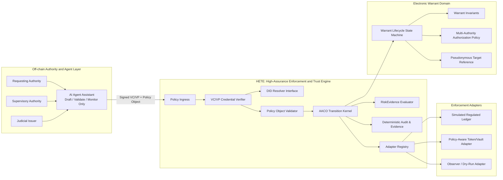

# HETE Sandbox 전자 자산동결 영장 정책 프레임워크 추가 개발 작업지시서

**문서 번호:** HETE-SCI-EW-DEV-001  
**대상 저장소:** `hete_sandbox`  
**대상 논문 제목:** *HETE: A Machine-Verifiable Policy Framework for DID-Based Multi-Authority Enforcement of Asset-Freezing Warrants*  
**HETE 정의:** **High-Assurance Enforcement and Trust Engine**  
**문서 목적:** 기존 `hete` 저장소의 투표 시스템에 결합된 전자영장 기능을 재사용하지 않고, 공개 저장소 `hete_sandbox`에서 SCI 논문 검증용으로 독립적이고 도메인 중립적인 정책 프레임워크를 추가 개발하기 위한 구현·검증 작업지시서  
**개발 원칙:** Clean-room reimplementation, domain decoupling, explicit trust boundaries, machine-verifiable policy, reproducible evaluation

---

## 1. 작업 배경

기존 전자영장 시스템은 다음 기능을 이미 시도하였다.

- 법원, 수사기관, 검찰의 다기관 서명 검증
- 영장 승인·거절에 따른 상태 전이
- 사전 커밋 기반 임시 잠금
- 금액 제한형 부분 동결
- 만료 및 해제
- 감사 기록
- DID 및 영장 식별자의 해시 기반 저장

그러나 기존 구현은 `survey_id`, `nullifier_merkle_root`, 투표 집계, 유권자 상태, 보상 에스크로 등 Voting Domain 구조에 강하게 결합되어 있다. 기존 `hete-warrant-handler`도 특정 투표 컨트랙트에 하드코딩된 SubMessage를 발송하므로 독립적인 법률·금융·행정 정책 서비스로 재사용하기 어렵다.

반면 `hete_sandbox`는 이미 다음 기반을 보유한다.

- `poa-core`: 도메인 중립 AACO 5단계 상태 전이 커널
- `poa-protocol`: 선언적 프로토콜 명세, 상속, 정규화, 정책 다이제스트
- `poa-sandbox`: OpenBSD `pledge`/`unveil` 기반 프로세스 격리
- `RiskEvidence`: 위험 증거에 따른 `Commit`, `Reject`, `Quarantine`, `Abort`
- 결정론적 감사 레코드
- 아키텍처 불변식 자동검증
- Python 기반 평가·보고 도구

이번 개발은 전자영장을 독립적인 애플리케이션으로 단순 이식하는 것이 아니라, **전자영장을 기계 검증 가능한 정책 객체로 표현하고 HETE가 이를 검증·조정·집행하는 범용 서비스 계층**으로 구현해야 한다.

---

## 2. 최종 목표

`hete_sandbox`에 다음 성격의 독립 프레임워크를 구현한다.

> HETE는 DID/VC로 증명된 다기관 권한, 대상·금액·기간·행위 범위, 취소·정정·감사 규칙을 포함하는 정책 객체를 검증하고, 도메인별 집행 Adapter를 통해 제한된 상태 전이를 수행하는 High-Assurance Enforcement and Trust Engine이다.

전자영장은 첫 번째 reference domain으로 구현하되, HETE core는 향후 다음 서비스에 재사용 가능해야 한다.

- 금융·가상자산 지급정지 및 부분 동결
- AI Agent assisted 행정처리
- 디지털 증거 보존명령
- 접근·사용·이동 제한 정책
- 의료·국방·IoT·드론의 다기관 승인 정책
- CBDC 및 규제형 토큰 컴플라이언스
- Zero Trust 기반 고위험 업무 승인
- 정책 기반 AI Agent delegation 및 revocation

---

## 3. 필수 설계 원칙

### 3.1 기존 `hete` 코드 비의존

다음은 금지한다.

- `hete` 저장소 crate 또는 source path에 대한 Cargo dependency
- `voting-common`, `voter-manager`, `tally-accumulator`, `reward-escrow` 재사용
- `survey_id`, `nullifier`, `vote`, `voter`, `tally`, `reward` 필드의 core 유입
- 기존 CosmWasm 컨트랙트의 복사·붙여넣기
- 기존 보고서의 기술적 주장을 구현 검증 없이 재현

기존 자료는 요구사항 분석과 실패 원인 파악에만 사용한다. 코드는 `hete_sandbox`의 POA/AACO 모델에 맞춰 clean-room 방식으로 새로 작성한다.

### 3.2 Core와 Domain의 엄격한 분리

`poa-core`, `poa-protocol`, `poa-sandbox`는 전자영장 도메인에 의존하면 안 된다.

허용되는 의존 방향은 다음과 같다.

```text
poa-core
poa-protocol
poa-sandbox
    ↑
hete-identity / hete-credential / hete-policy
    ↑
domain-electronic-warrant
    ↑
adapter-regulated-asset / adapter-simulated-ledger
    ↑
evaluation scenarios
```

금지되는 방향:

```text
poa-core ─X→ domain-electronic-warrant
poa-protocol ─X→ adapter-regulated-asset
poa-sandbox ─X→ warrant, amount, court, prosecutor
```

### 3.3 법적 권한과 기술적 실행의 분리

HETE는 법적 권한을 생성하지 않는다. HETE는 다음만 수행한다.

1. 이미 발급된 credential과 presentation을 검증
2. 정책 객체의 형식과 권한 규칙을 검증
3. 실행 전후 불변식을 평가
4. 허용된 Adapter에 제한된 명령 전달
5. 결정과 증거를 감사 로그로 기록

AI Agent 또는 스마트 컨트랙트가 독자적으로 영장을 발급하거나 권한 범위를 확장하는 기능은 구현하지 않는다.

### 3.4 적용 범위의 명시

이번 시스템은 임의의 퍼블릭 블록체인 계정을 보편적으로 동결하는 시스템이 아니다.

평가 대상은 다음으로 제한한다.

- HETE-aware regulated asset
- HETE policy hook을 호출하는 token/vault/account
- simulated regulated ledger
- 명시적으로 등록된 enforcement adapter

논문과 코드에서 `universal account freezing`, `consensus-level blocking`, `mempool-level rejection`을 주장하지 않는다.

### 3.5 결정론 및 재현 가능성

- 정책 정규화와 다이제스트는 동일 입력에 대해 동일 결과를 생성해야 한다.
- 부동소수점 연산을 사용하지 않는다.
- 시간은 테스트 가능한 `Clock` abstraction을 통해 주입한다.
- 랜덤 nonce와 salt는 인터페이스로 주입하며 테스트에서는 고정 fixture를 사용한다.
- benchmark 원자료는 CSV 또는 JSONL로 저장한다.
- 모든 논문 표와 그래프는 원자료에서 자동 생성한다.

---

## 4. 목표 아키텍처



---

## 5. 권장 저장소 구조

기존 네 개 crate를 유지하고 다음 crate와 디렉터리를 추가한다.

```text
hete_sandbox/
├── crates/
│   ├── poa-core/
│   ├── poa-protocol/
│   ├── poa-sandbox/
│   ├── poa-verifier-example/
│   │
│   ├── hete-identity/                    # DID 및 기관 신뢰 레지스트리 추상화
│   ├── hete-credential/                  # VC/VP envelope와 crypto verification
│   ├── hete-policy/                      # 범용 Machine-Verifiable Policy Object
│   ├── hete-adapter-api/                 # 범용 집행 adapter trait 및 capability model
│   ├── domain-electronic-warrant/        # 전자영장 정책·상태 머신·불변식
│   ├── adapter-simulated-asset/          # 논문 검증용 결정론적 규제 자산 ledger
│   ├── adapter-policy-token/             # 선택: policy-aware token/vault reference adapter
│   └── hete-warrant-verifier/            # E2E 실행 CLI/service
│
├── protocol/
│   ├── base/
│   ├── schemas/
│   │   ├── machine_policy.schema.json
│   │   ├── authority_policy.schema.json
│   │   ├── warrant_policy.schema.json
│   │   └── adapter_manifest.schema.json
│   ├── examples/
│   │   └── electronic_warrant/
│   └── fixtures/
│       └── electronic_warrant/
│
├── spec/
│   ├── poa-risk-evidence.md
│   ├── hete-machine-policy-object.md
│   ├── hete-credential-profile.md
│   ├── hete-adapter-contract.md
│   ├── electronic-warrant-profile.md
│   ├── electronic-warrant-threat-model.md
│   └── electronic-warrant-formal-properties.md
│
├── evaluation/
│   ├── check_architecture.py
│   ├── check_warrant_invariants.py
│   ├── generate_report.py
│   ├── experiments/
│   │   ├── functional_correctness.py
│   │   ├── scale_benchmark.py
│   │   ├── concurrency_benchmark.py
│   │   ├── attack_simulation.py
│   │   ├── privacy_surface_audit.py
│   │   └── adapter_overhead.py
│   ├── scenarios/
│   ├── fixtures/
│   └── results/
│       ├── raw/
│       ├── processed/
│       ├── figures/
│       └── manifests/
│
├── formal/
│   ├── tla/
│   │   └── ElectronicWarrant.tla
│   ├── properties/
│   └── traces/
│
├── docs/
│   ├── architecture/
│   ├── work_reports/
│   └── scientific_evidence/
│
└── .github/workflows/
    ├── ci.yml
    ├── architecture.yml
    ├── formal-check.yml
    └── evaluation-smoke.yml
```

---

## 6. 범용 Machine-Verifiable Policy Object 구현

### 6.1 범용 정책 객체

`hete-policy`에 전자영장에 한정되지 않는 정책 객체를 구현한다.

```rust
pub struct MachinePolicyObject {
    pub policy_id: PolicyId,
    pub policy_type: String,
    pub version: String,

    pub issuer: AuthorityRef,
    pub authorization_policy: AuthorizationPolicy,
    pub subject: SubjectRef,
    pub resource: ResourceRef,
    pub permitted_actions: Vec<ActionConstraint>,

    pub validity: ValidityWindow,
    pub conditions: Vec<PolicyCondition>,
    pub obligations: Vec<PolicyObligation>,
    pub revocation: RevocationRule,

    pub evidence_refs: Vec<EvidenceRef>,
    pub credential_refs: Vec<CredentialRef>,

    pub nonce: Nonce,
    pub domain_binding: DomainBinding,
    pub policy_digest: PolicyDigest,
}
```

### 6.2 필수 범용 필드 의미

| 필드 | 목적 |
|---|---|
| `policy_id` | 정책 객체의 전역 식별 |
| `policy_type` | 전자영장, 접근허가, 격리명령 등 profile 구분 |
| `issuer` | 발급 권한기관 |
| `authorization_policy` | 승인 역할, 정족수, 순서, 상호배제 규칙 |
| `subject` | 정책 적용 주체의 가명 참조 |
| `resource` | 자산, 계정, 금고, 데이터, 장치 등 대상 자원 |
| `permitted_actions` | 동결, 해제, 몰수, 조회 등 허용된 실행 |
| `validity` | 발효·만료·최대 지속기간 |
| `conditions` | 집행 전 검증 조건 |
| `obligations` | 집행 후 감사·통지·검토 의무 |
| `revocation` | 취소·정정·중단 규칙 |
| `nonce` | replay 방지 |
| `domain_binding` | chain/service/adapter/environment binding |
| `policy_digest` | RFC 8785 정규화 후 SHA-256 |

### 6.3 정규화 및 다이제스트

기존 `poa-protocol`의 RFC 8785 canonicalization과 SHA-256 digest를 재사용한다.

다음 불변식을 테스트한다.

```text
POL-001: 의미상 동일하고 key 순서만 다른 JSON은 동일 digest를 생성한다.
POL-002: amount, expiry, target, authority 중 하나라도 달라지면 digest가 달라진다.
POL-003: 상속 후 EffectivePolicy digest가 계산되며 원본 fragment digest와 혼동되지 않는다.
POL-004: privilege expansion은 명시적 승인 없이 상속될 수 없다.
POL-005: unknown critical field가 존재하면 fail closed 한다.
```

---

## 7. 전자영장 Domain Profile 구현

### 7.1 전자영장 정책 객체

`domain-electronic-warrant`에서 범용 정책 객체를 다음 profile로 확장한다.

```rust
pub struct AssetFreezingWarrant {
    pub common: MachinePolicyObject,

    pub case_reference: PseudonymousCaseRef,
    pub warrant_reference: WarrantRef,
    pub jurisdiction: JurisdictionRef,

    pub asset_scope: AssetScope,
    pub freeze_rule: FreezeRule,
    pub execution_rule: ExecutionRule,

    pub requesting_authority: AuthorityRef,
    pub supervisory_authority: Option<AuthorityRef>,
    pub judicial_issuer: AuthorityRef,

    pub review_rule: ReviewRule,
    pub appeal_or_hold_rule: Option<HoldRule>,
}
```

### 7.2 금액 제한 모델

기존의 전체 거래 이력을 매번 합산하는 방식은 사용하지 않는다. Adapter는 현재 잔액과 예약된 동결액을 상태로 관리한다.

```rust
pub struct FreezePosition {
    pub warrant_id: WarrantId,
    pub asset_id: AssetId,
    pub reserved_amount: u128,
    pub executed_amount: u128,
    pub released_amount: u128,
    pub effective_from: Timestamp,
    pub expires_at: Timestamp,
    pub status: FreezeStatus,
}
```

가용 출금액은 다음 규칙으로 계산한다.

```text
available_to_transfer =
    current_balance
    - active_reserved_amount
    - pending_execution_amount
```

필수 규칙:

```text
AMT-001: reserved_amount는 warrant maximum을 초과할 수 없다.
AMT-002: executed_amount + released_amount는 reserved_amount를 초과할 수 없다.
AMT-003: 동일 자산에 여러 영장이 존재하면 합산 예약액은 current balance를 초과할 수 있으나,
         출금 가능액은 음수가 아닌 0으로 포화 처리한다.
AMT-004: 신규 입금의 동결 포함 여부는 policy의 inflow_rule로 명시한다.
AMT-005: expired/revoked warrant는 active_reserved_amount에 포함하지 않는다.
AMT-006: adapter가 authoritative balance를 제공하지 못하면 실행을 Abort 또는 Quarantine한다.
```

### 7.3 영장 상태 머신

다음 상태를 구현한다.

```rust
pub enum WarrantState {
    Draft,
    Submitted,
    CredentialVerified,
    Authorized,
    Scheduled,
    Active,
    PartiallyExecuted,
    FullyExecuted,
    Suspended,
    Revoked,
    Expired,
    Released,
    Rejected,
    Failed,
}
```

권장 전이:

```text
Draft
  -> Submitted
  -> CredentialVerified
  -> Authorized
  -> Scheduled or Active
  -> PartiallyExecuted
  -> FullyExecuted

Authorized/Active/PartiallyExecuted
  -> Suspended
  -> Active or Revoked

Active/PartiallyExecuted
  -> Expired
  -> Released

Any non-terminal state
  -> Rejected or Failed
```

금지 전이 예:

```text
Rejected -> Active
Expired -> Active
Revoked -> Active
FullyExecuted -> increase amount
Released -> PartiallyExecuted
```

### 7.4 AACO 단계 매핑

전자영장 실행을 기존 AACO 5단계에 다음과 같이 연결한다.

| AACO 단계 | 전자영장 처리 |
|---|---|
| `authorize` | 기관 역할, credential issuer, 서명자 조합, 정족수, 상호배제, domain binding |
| `validate` | schema, nonce, timestamp, amount, asset ID, adapter capability, revocation status |
| `mutate_candidate` | 영장 candidate state 및 자산 예약 candidate 생성 |
| `reconcile` | 금액 보존, 만료, 중복, 상태 전이, Adapter snapshot 일치 검증 |
| `commit` | 영장 상태와 Adapter 상태를 원자적으로 반영하고 감사증거 생성 |

RiskEvidence가 임계치를 초과하면 실제 자산 상태를 변경하지 않고 `Quarantine`으로 라우팅한다.

---

## 8. DID 및 다기관 Credential 검증

### 8.1 `hete-identity`

다음 인터페이스를 구현한다.

```rust
pub trait DidResolver {
    fn resolve(&self, did: &Did) -> Result<DidDocument, IdentityError>;
}

pub trait TrustRegistry {
    fn authority_status(
        &self,
        did: &Did,
        role: AuthorityRole,
        at: Timestamp,
    ) -> Result<AuthorityStatus, IdentityError>;
}
```

지원 범위는 최소 구현으로 제한한다.

- local fixture DID method 또는 `did:key`
- Ed25519 verification method
- key identifier
- activation/revocation timestamps
- authority role registry

외부 네트워크 DID resolution은 SCI 검증의 결정론성을 해칠 수 있으므로 기본 benchmark에서는 사용하지 않는다. 별도 integration test에서만 허용한다.

### 8.2 `hete-credential`

VC/VP 전체 표준을 무리하게 구현하지 말고, 논문 검증에 필요한 명시적 credential profile을 정의한다.

```rust
pub struct CredentialEnvelope {
    pub id: CredentialId,
    pub issuer: Did,
    pub subject: SubjectRef,
    pub credential_type: Vec<String>,
    pub issuance_time: Timestamp,
    pub expiration_time: Option<Timestamp>,
    pub status: Option<CredentialStatusRef>,
    pub claims: CanonicalJson,
    pub proof: CredentialProof,
}

pub struct PresentationEnvelope {
    pub holder: Did,
    pub verifiable_credentials: Vec<CredentialEnvelope>,
    pub challenge: Nonce,
    pub domain: String,
    pub proof: PresentationProof,
}
```

### 8.3 서명 메시지 Domain Separation

모든 승인 서명은 다음 값을 포함한다.

```text
HETE-EW-V1
|| environment_id
|| policy_digest
|| warrant_id
|| target_ref
|| asset_scope
|| maximum_amount
|| not_before
|| expires_at
|| action
|| nonce
```

필수 테스트:

```text
AUTH-001: 한 기관 서명 누락 시 Reject
AUTH-002: 승인 정책에 없는 역할 서명은 무시 또는 Reject
AUTH-003: 동일 DID가 상호배제 역할 두 개를 동시에 충족하지 못함
AUTH-004: 다른 chain/service/adapter에서 재사용 시 Reject
AUTH-005: 만료 credential Reject
AUTH-006: revoked key 또는 credential Reject
AUTH-007: nonce 재사용 Reject
AUTH-008: 변경된 amount/target/expiry에 기존 서명 재사용 불가
AUTH-009: 잘못된 key id Reject
AUTH-010: threshold와 sequential approval policy를 각각 검증
```

### 8.4 다기관 정책의 관할권 독립성

기관 이름을 코드에 `Court`, `Police`, `Prosecutor`로 하드코딩하지 않는다.

```rust
pub enum AuthorityRole {
    Requester,
    LegalReviewer,
    JudicialIssuer,
    Executor,
    Auditor,
    Custom(String),
}
```

한국 사례는 fixture로 제공한다.

```text
Requester        = Investigation Agency
LegalReviewer    = Prosecutorial Authority
JudicialIssuer   = Judge/Court
Executor         = Regulated Asset Service Provider
Auditor          = Judicial/Oversight Authority
```

다른 국가의 절차는 JSON policy로 승인 순서와 threshold를 변경할 수 있어야 한다.

---

## 9. Adapter API와 자산 집행 범위

### 9.1 범용 Adapter Trait

`hete-adapter-api`에 다음 인터페이스를 정의한다.

```rust
pub trait EnforcementAdapter {
    fn manifest(&self) -> AdapterManifest;

    fn inspect(
        &self,
        resource: &ResourceRef,
    ) -> Result<ResourceSnapshot, AdapterError>;

    fn prepare(
        &mut self,
        command: &EnforcementCommand,
    ) -> Result<PreparedChange, AdapterError>;

    fn commit(
        &mut self,
        prepared: PreparedChange,
    ) -> Result<ExecutionReceipt, AdapterError>;

    fn rollback(
        &mut self,
        prepared: PreparedChange,
    ) -> Result<(), AdapterError>;
}
```

### 9.2 Adapter Capability

```rust
pub struct AdapterManifest {
    pub adapter_id: AdapterId,
    pub version: String,
    pub supported_resources: Vec<ResourceKind>,
    pub supported_actions: Vec<EnforcementAction>,
    pub supports_atomic_prepare_commit: bool,
    pub supports_amount_bounded_freeze: bool,
    pub supports_expiration: bool,
    pub supports_revocation: bool,
    pub authoritative_balance: bool,
}
```

지원하지 않는 기능은 추정하지 말고 fail closed 한다.

### 9.3 논문용 Adapter

최소 두 개를 구현한다.

#### A. `adapter-simulated-asset`

- 결정론적 in-memory 또는 embedded DB ledger
- 계정, 자산, 잔액, 예약액 관리
- freeze, release, execute/forfeit
- deterministic clock
- transaction history와 audit receipt
- concurrency conflict version
- 실험의 주 reference adapter

#### B. `observer/dry-run adapter`

- 실제 상태 변경 없음
- 정책 검증 결과와 예상 변화만 기록
- AI Agent assisted 행정서비스의 사전 검토·human approval 시나리오에 사용

선택 사항:

#### C. `adapter-policy-token`

- HETE hook을 호출하는 reference token/vault
- 특정 블록체인에 종속되지 않는 state machine 수준 구현 우선
- CosmWasm 연동은 별도 feature 또는 후속 milestone
- 제목의 일반성을 훼손하지 않도록 core package와 분리

---

## 10. 사전 커밋 및 Front-Running 관련 재설계

### 10.1 기존 주장 폐기

다음 구현·주장은 사용하지 않는다.

- 스마트 컨트랙트가 mempool fee sorting 이전에 임의 거래를 차단한다는 주장
- commit hash만으로 숨겨진 target을 즉시 식별·잠금한다는 주장
- public mempool에서 target confidentiality와 instant lock을 동시에 완전히 달성한다는 주장
- 단일 50배 gas 실험으로 front-running을 완전 방어했다고 결론

### 10.2 새로운 모델

사전 커밋은 다음 두 모드로 구현한다.

#### Mode 1: Public two-phase authorization

- commit은 policy digest와 nonce를 사전 등록
- commit 자체로 target 자산을 잠그지 않음
- reveal/activation 시 Adapter가 정책을 집행
- 목적: replay, equivocation, 사후 정책 변경 방지
- 보장: intent integrity, not target secrecy

#### Mode 2: Confidential submission interface

- HETE core는 `ConfidentialIngress` trait만 정의
- reference 구현은 local sealed envelope simulation
- 실제 private relay, threshold encryption, encrypted mempool은 구현 범위 밖
- 목적: 어떤 외부 confidential transport가 필요한지 명확히 모델링
- 보장 수준은 구현별로 metadata에 기록

```rust
pub trait ConfidentialIngress {
    fn submit_sealed(
        &self,
        envelope: SealedPolicyEnvelope,
    ) -> Result<IngressReceipt, IngressError>;
}
```

### 10.3 평가 시나리오

```text
FR-01: execute transaction 관찰 후 자산 도피 시도
FR-02: public commit 관찰 후 자산 도피 시도
FR-03: target hash 사전 계산
FR-04: 높은 priority ordering
FR-05: malicious ordering simulator
FR-06: commit censorship
FR-07: reveal 지연 및 commit expiry
FR-08: confidential ingress metadata leakage
```

결론은 공격자 모델별로 제한한다.

예:

```text
HETE prevents post-activation transfers for policy-aware assets.
HETE's public commitment mode does not by itself provide target confidentiality
or consensus-level transaction-order guarantees.
```

---

## 11. 프라이버시 및 데이터 최소화

### 11.1 용어

코드와 문서에서는 다음 표현을 사용한다.

- `pseudonymous reference`
- `data minimization`
- `reduced direct disclosure`
- `linkability risk`
- `off-chain mapping`
- `crypto-shredding support`

다음 표현은 금지한다.

- absolute anonymity
- complete de-anonymization resistance
- full GDPR compliance
- right to erasure guaranteed

### 11.2 Target Reference

```rust
pub struct PseudonymousTargetRef {
    pub scheme: TargetRefScheme,
    pub digest: [u8; 32],
    pub salt_id: Option<String>,
    pub epoch: Option<u64>,
}
```

권장 생성:

```text
target_ref =
SHA-256(
    domain_separator
    || normalized_subject_identifier
    || resource_id
    || warrant_id
    || random_salt
)
```

salt 원문을 public state에 저장하지 않는다.

### 11.3 Privacy Surface Audit

다음 모든 위치를 검사한다.

- input policy JSON
- credential envelope
- IPC payload
- process log
- audit record
- adapter receipt
- embedded DB
- exported CSV/JSONL
- panic/error message
- telemetry label
- temporary file
- network capture fixture
- optional blockchain transaction calldata/event/state

자동 검사기는 fixture의 금지 문자열을 전체 산출물에서 검색한다.

```text
PRIV-001: plaintext subject DID가 audit record에 없어야 함
PRIV-002: subject name 또는 case narrative가 telemetry label에 없어야 함
PRIV-003: error message가 raw credential을 출력하지 않아야 함
PRIV-004: stable target hash 재사용에 따른 linkability를 별도 지표로 기록
PRIV-005: salt deletion 후 off-chain mapping 복구 불가 여부를 simulation
PRIV-006: policy digest 자체가 저엔트로피 필드를 노출하는지 분석
```

---

## 12. 보안 및 위협 모델

`spec/electronic-warrant-threat-model.md`를 반드시 작성한다.

### 12.1 자산

- 기관 private key
- DID document와 trust registry
- policy object
- credential 및 presentation
- target mapping
- adapter state
- audit evidence
- revocation status
- execution receipt
- experiment raw data

### 12.2 신뢰 주체

- requesting authority
- legal reviewer
- judicial issuer
- executor
- auditor
- HETE process
- OS sandbox
- adapter
- DID resolver
- storage
- optional blockchain validator/proposer

### 12.3 공격자 능력

- credential 위조 및 변조
- 승인기관 key 하나 탈취
- replay 및 cross-domain replay
- stale DID document 제공
- revoked credential 재사용
- nonce 충돌·재사용
- target hash dictionary attack
- policy downgrade
- adapter capability 위조
- race condition 및 concurrent execution
- duplicate warrant execution
- expiry boundary attack
- audit log omission 또는 변조
- malicious AI Agent draft
- denial-of-service
- public transaction ordering manipulation
- configuration privilege expansion
- OS resource escape 시도

### 12.4 명시적 비보장

- permissionless chain의 모든 자산 강제 동결
- 악성 majority consensus 방어
- 법적 유효성 자체의 자동 판정
- 자연어 영장 내용의 완전한 의미 이해
- 잘못 발급된 적법 형식 영장의 실체적 정당성 판단
- 외부 DID resolver의 가용성
- 피해 자산의 cross-chain 회수
- private key가 통제하는 비통합 자산의 강제 집행

---

## 13. 정형 분석

### 13.1 최소 정형화 대상

`formal/tla/ElectronicWarrant.tla` 또는 동등한 상태 모델을 작성한다.

상태 변수 예:

```text
warrant_state
authorized_roles
nonce_registry
active_freezes
asset_balance
reserved_amount
executed_amount
released_amount
current_time
audit_log
adapter_version
```

### 13.2 Safety Properties

```text
SAFE-001 UnauthorizedExecution:
승인 정책을 충족하지 않은 영장은 Active 또는 Executed가 될 수 없다.

SAFE-002 NoReplay:
동일 nonce와 policy digest는 둘 이상의 성공 실행을 만들 수 없다.

SAFE-003 AmountBound:
executed_amount <= authorized_maximum_amount

SAFE-004 Conservation:
executed_amount + released_amount <= reserved_amount

SAFE-005 NoPostExpiryExecution:
current_time >= expires_at 이후 신규 execute는 성공하지 않는다.

SAFE-006 RevocationSafety:
Revoked 이후 새로운 adapter commit이 발생하지 않는다.

SAFE-007 DomainBinding:
다른 environment/adapter/resource의 credential은 사용되지 않는다.

SAFE-008 Atomicity:
warrant state가 성공으로 바뀌고 adapter state가 실패하는 부분 커밋이 없다.

SAFE-009 AuditCompleteness:
모든 terminal outcome은 하나 이상의 AuditRecord를 생성한다.

SAFE-010 DomainNeutralCore:
core state model에 warrant-specific symbol이 존재하지 않는다.
```

### 13.3 Liveness Properties

```text
LIVE-001 AuthorizedExecutionProgress:
유효한 credential, 사용 가능한 adapter, 비만료 정책에서 실행 요청은
Commit, Reject, Quarantine, Abort 중 하나의 terminal outcome에 도달한다.

LIVE-002 ExpirationProgress:
시간이 만료를 지나고 scheduler가 공정하게 실행되면 Active 영장은 Expired/Released에 도달한다.

LIVE-003 QuarantineReview:
Quarantine된 요청은 명시적 review action으로 terminal state에 도달할 수 있다.
```

### 13.4 Rust Property-Based Testing

`proptest` 또는 유사 도구로 다음을 검증한다.

- 임의 상태 전이 시 금지 전이가 발생하지 않음
- amount conservation
- replay resistance
- timestamp boundary
- 복수 영장 합산
- adapter failure injection
- malformed credential
- canonicalization stability

정형 모델 trace와 Rust 테스트 trace를 가능한 한 동일한 fixture 형식으로 연결한다.

---

## 14. 감사 및 Evidence 모델

기존 `poa-core::AuditRecord`를 확장하되 core에 전자영장 필드를 직접 추가하지 않는다. domain metadata map 또는 typed evidence envelope를 사용한다.

```rust
pub struct EnforcementEvidence {
    pub audit_id: AuditId,
    pub policy_digest: PolicyDigest,
    pub transition_id: TransitionId,
    pub actor_refs: Vec<PseudonymousActorRef>,
    pub authority_roles: Vec<AuthorityRole>,
    pub adapter_id: AdapterId,
    pub adapter_version: String,
    pub before_digest: StateDigest,
    pub candidate_digest: StateDigest,
    pub after_digest: Option<StateDigest>,
    pub outcome: TransitionOutcome,
    pub reason_code: String,
    pub timestamp: Timestamp,
}
```

필수 조건:

```text
AUD-001: raw subject identifier 저장 금지
AUD-002: 성공과 실패 모두 기록
AUD-003: 정책 digest와 adapter version 기록
AUD-004: state before/candidate/after digest 기록
AUD-005: 결정론적 직렬화
AUD-006: hash-chain 또는 Merkle batch로 tamper evidence 제공
AUD-007: 오류 발생 시 credential 원문을 log에 포함하지 않음
AUD-008: 논문 평가 run_id와 source commit hash 연결
```

---

## 15. AI Agent 연계 경계

이번 milestone에서 AI Agent는 선택적 simulator 또는 client로만 구현한다.

허용 역할:

- policy draft 생성
- schema validation 요청
- 누락 필드 경고
- 권한·금액·기간의 과잉 여부 검토
- dry-run
- 만료·revocation 상태 모니터링
- human approval queue에 전달

금지 역할:

- 자체 credential 발급
- 기관 서명 생성
- approval threshold 우회
- 정책의 금액·기간 임의 확장
- Adapter 직접 호출
- Quarantine 자동 해제
- human approval 없이 실제 집행

모든 Agent 요청은 일반 actor와 동일하게 DID, delegated credential, scope, expiry를 검증한다.

선택적으로 다음 구조를 추가한다.

```rust
pub struct AgentDelegation {
    pub delegator: AuthorityRef,
    pub agent_did: Did,
    pub allowed_actions: Vec<String>,
    pub policy_types: Vec<String>,
    pub maximum_amount: Option<u128>,
    pub expires_at: Timestamp,
    pub human_confirmation_required: bool,
}
```

---

## 16. 아키텍처 불변식 확장

기존 `ARCH-001~004`에 다음을 추가한다.

```text
ARCH-005: poa-core는 warrant, court, prosecutor, freeze, asset amount 용어를 포함하지 않는다.
ARCH-006: hete-policy는 domain-electronic-warrant에 의존하지 않는다.
ARCH-007: domain-electronic-warrant는 구체 adapter 구현에 의존하지 않고 hete-adapter-api에만 의존한다.
ARCH-008: adapter crate는 credential verification을 직접 수행하지 않는다.
ARCH-009: authority role은 core에 하드코딩되지 않고 policy로 구성된다.
ARCH-010: voting 관련 symbol이 신규 warrant crates에 존재하지 않는다.
ARCH-011: 모든 enforcement adapter는 manifest와 capability test를 제공한다.
ARCH-012: benchmark 결과는 source commit, build profile, host metadata를 포함한다.
ARCH-013: production path에서 Noop sandbox backend 사용 시 명시적 insecure flag가 필요하다.
ARCH-014: critical policy field를 ignore하는 serde 설정을 금지한다.
ARCH-015: audit 및 telemetry에 금지된 plaintext fixture가 존재하지 않는다.
```

---

## 17. 실험 설계

### 17.1 연구 질문

```text
RQ1. 다기관 DID/VC 승인 구조는 단일 관리자 및 일반 multisig 방식과 비교해
     무단 실행을 방지하면서 어떤 계산·지연 비용을 추가하는가?

RQ2. 금액 제한, 만료, revocation, audit를 포함한 정책 객체를 HETE/AACO로
     집행할 때 기능 정확성과 상태 보존 불변식이 유지되는가?

RQ3. 정책 수, 동시 요청, credential 크기, 승인기관 수, 활성 영장 수가 증가할 때
     latency, throughput, memory, storage, execution cost는 어떻게 변화하는가?

RQ4. 공개 commit, confidential ingress simulation, direct execution 방식은
     공격자 모델별 자산 도피 성공률과 정보 노출에 어떤 차이를 보이는가?

RQ5. 가명 참조와 최소 감사 레코드가 직접 평문 노출을 얼마나 줄이며,
     어떤 linkability와 off-chain re-identification 위험이 남는가?

RQ6. HETE의 domain-neutral core와 electronic-warrant profile 분리가
     아키텍처 불변식과 신규 domain 재사용 시험에서 유지되는가?
```

### 17.2 Baseline

최소 다음 비교군을 구현한다.

| ID | Baseline |
|---|---|
| B0 | 단일 중앙 관리자 freeze |
| B1 | 단순 N-of-M multisig freeze |
| B2 | DID/VC validation only, amount/expiry 없음 |
| B3 | HETE policy object + single authority |
| B4 | HETE full multi-authority, risk disabled |
| B5 | HETE full multi-authority + RiskEvidence + audit |
| B6 | HETE dry-run/observer mode |

### 17.3 기능 정확성 시험

최소 30개 scenario fixture를 만든다.

- 정상 승인 및 동결
- 부분 동결
- 잔액보다 큰 영장
- 복수 자산
- 복수 영장
- 신규 입금 처리
- 부분 집행
- 전액 집행
- 자동 만료
- 수동 해제
- revocation
- suspension
- duplicate execution
- wrong adapter
- unsupported capability
- missing authority
- duplicate role
- compromised single authority simulation
- expired VC
- revoked VC
- wrong domain
- wrong nonce
- changed amount
- changed target
- concurrent transfer
- concurrent warrant
- adapter prepare failure
- adapter commit failure
- audit write failure
- risk quarantine
- policy inheritance privilege expansion

### 17.4 규모 시험

권장 기본 매트릭스:

| 변수 | 값 |
|---|---|
| 등록 정책 수 | 100, 1K, 10K, 100K |
| 활성 영장 수 | 0, 10, 100, 1K, 10K |
| 동시 client | 1, 4, 16, 64, 256 |
| 승인기관 수 | 1, 2, 3, 5, 7 |
| credential 수 | 1, 2, 3, 5, 10 |
| credential 크기 | 1KB, 2KB, 4KB, 8KB, 16KB |
| Adapter 상태 수 | 100, 1K, 10K, 100K |
| risk evidence 수 | 0, 1, 4, 16, 64 |
| 반복 수 | warm-up 후 최소 1000, 주요 조건 30 independent runs |

측정:

- end-to-end latency
- authorize latency
- validate latency
- candidate mutation latency
- reconcile latency
- commit latency
- P50/P95/P99
- throughput
- CPU time
- peak RSS
- storage growth
- audit bytes/action
- failure rate
- quarantine rate
- lock contention
- adapter retry count

### 17.5 Attack Simulation

각 공격은 최소 100회 이상 반복하고 공격 성공률을 정의한다.

```text
ASR = successful unauthorized or escape outcomes / total attack attempts
BRR = 1 - ASR
```

공격군:

- replay
- cross-domain replay
- credential mutation
- signer omission
- signer collusion assumptions
- stolen one-key
- timestamp boundary
- public commit observation
- high-priority transaction ordering simulation
- target hash enumeration
- duplicate warrant ID
- concurrent execution
- stale adapter snapshot
- audit suppression
- policy downgrade
- privilege-expanding inheritance
- OS sandbox escape probe

### 17.6 Privacy Evaluation

정량 지표:

- plaintext exposure count
- unique pseudonymous identifiers
- cross-run linkability rate
- stable-hash correlation rate
- audit record size
- credential retention time
- salt deletion recoverability simulation
- information surface by component

### 17.7 통계 및 보고

- 평균만 제시하지 않는다.
- median, P95, P99, standard deviation, 95% CI를 포함한다.
- outlier 제거 여부와 기준을 기록한다.
- warm-up과 measurement phase를 구분한다.
- raw data를 변경하지 않는다.
- processed data 생성 스크립트와 hash를 저장한다.
- 모든 표·그래프는 자동 생성한다.
- 동일 commit에서 재실행할 수 있는 manifest를 저장한다.

---

## 18. 성능 측정의 시간 정의

`latency`를 다음으로 분리한다.

```text
T_policy_parse
T_canonicalize
T_did_resolve
T_credential_verify
T_authorize
T_validate
T_candidate
T_reconcile
T_adapter_prepare
T_adapter_commit
T_audit
T_total
```

블록체인 Adapter를 추가할 경우 별도 분리:

```text
T_rpc_submit
T_mempool_accept
T_block_inclusion
T_execution
T_finality
```

단순 함수 실행 시간을 `warrant enforcement latency`로 부르지 않는다.

---

## 19. 구현 단계와 작업 패키지

### WP0. 기준선 고정

**목표:** 현재 `hete_sandbox` 상태와 평가 환경을 재현 가능하게 고정

작업:

- Git commit/tag 기록
- `cargo test --workspace`
- architecture checker 실행
- OS 및 Rust/Python 버전 저장
- 기존 benchmark smoke result 저장
- 신규 branch 생성: `feature/machine-verifiable-warrant-policy`

산출물:

- `docs/work_reports/WP0_BASELINE.md`
- `evaluation/results/manifests/baseline_manifest.json`

완료 조건:

- 기존 테스트 전부 통과
- 신규 변경 전 결과 hash 확보

---

### WP1. 범용 정책 객체와 Adapter API

**목표:** 전자영장에 종속되지 않는 HETE policy foundation 구현

작업:

- `hete-policy` 생성
- `hete-adapter-api` 생성
- canonical policy digest 연결
- policy inheritance 및 privilege expansion 검증
- mock adapter와 unit test 작성

완료 조건:

- `POL-001~005` 통과
- `ARCH-005~009` 통과
- core에 domain symbol 없음

---

### WP2. DID 및 Credential Profile

**목표:** 다기관 권한을 검증 가능한 credential로 표현

작업:

- `hete-identity`
- `hete-credential`
- local DID fixture resolver
- Ed25519 signature verification
- challenge/domain/nonce binding
- revocation fixture
- threshold/sequential authorization policy

완료 조건:

- `AUTH-001~010` 통과
- cross-domain replay 0건
- raw credential logging 없음

---

### WP3. Electronic Warrant Domain

**목표:** 전자영장 profile, 상태 머신, 금액 불변식 구현

작업:

- `domain-electronic-warrant`
- warrant policy schema
- lifecycle state machine
- amount reservation model
- expiry/revocation/release
- risk-aware hooks
- typed reason codes

완료 조건:

- 금지 상태 전이 0건
- property-based test 최소 10,000 cases
- amount conservation 위반 0건

---

### WP4. Simulated Regulated Asset Adapter

**목표:** SCI 검증용 authoritative reference ledger 구현

작업:

- account/asset/balance/reservation
- optimistic version 또는 lock
- prepare/commit/rollback
- failure injection
- deterministic receipts
- dry-run adapter

완료 조건:

- partial commit 없음
- failure injection에서 원상복구
- 동시 실행 불변식 통과

---

### WP5. 감사·프라이버시·RiskEvidence 통합

**목표:** 실행 증거와 Quarantine을 논문 검증 수준으로 통합

작업:

- evidence envelope
- hash-chained audit
- privacy redaction
- risk threshold scenarios
- audit failure policy
- crypto-shredding simulation

완료 조건:

- `AUD-001~008`
- `PRIV-001~006`
- 모든 terminal outcome audit 생성

---

### WP6. 사전 커밋 및 Confidential Ingress 모델

**목표:** 기존의 과도한 front-running 주장을 기술적으로 정확한 모델로 대체

작업:

- public commitment mode
- sealed ingress trait
- local sealed-envelope simulation
- attacker ordering simulator
- commit expiry와 censorship scenario

완료 조건:

- public mode의 비보장 사항 문서화
- attack scenario 결과 자동 출력
- target-hidden instant lock을 주장하는 코드·문서 없음

---

### WP7. 정형 모델

**목표:** 핵심 safety/liveness 속성 검증

작업:

- TLA+ 상태 모델
- invariant 작성
- bounded model checking
- counterexample trace 저장
- Rust fixture와 trace mapping

완료 조건:

- `SAFE-001~010` 검증
- `LIVE-001~003` 검증 또는 제한 명시
- 발견된 counterexample에 대한 코드/명세 수정 기록

---

### WP8. 평가 자동화

**목표:** SCI 논문 표·그림을 생성할 수 있는 반복 가능 실험 체계 구축

작업:

- baseline B0~B6
- functional, scale, concurrency, attack, privacy experiments
- CSV/JSONL raw output
- statistical processing
- figure/table generation
- run manifest

완료 조건:

- 단일 command로 smoke run
- full evaluation runbook 제공
- 모든 그래프가 raw data에서 재생성
- 결과와 Git commit 연결

---

### WP9. 문서 및 논문 증거 패키지

**목표:** 개발 결과를 논문 revision과 직접 연결

산출물:

- `docs/architecture/HETE_WARRANT_ARCHITECTURE.md`
- `spec/electronic-warrant-threat-model.md`
- `spec/electronic-warrant-formal-properties.md`
- `docs/scientific_evidence/EXPERIMENT_DESIGN.md`
- `docs/scientific_evidence/RESULTS_SUMMARY.md`
- `docs/scientific_evidence/LIMITATIONS.md`
- `docs/scientific_evidence/CLAIM_EVIDENCE_MATRIX.md`
- architecture diagram
- sequence diagram
- trust-boundary diagram
- state-machine diagram
- evaluation dataset

완료 조건:

- 모든 논문 claim이 코드·test·result 경로와 연결
- 증거 없는 claim은 제거 또는 future work로 분류

---

## 20. Claim–Evidence Matrix

다음 표를 실제 결과로 채운다.

| 논문 주장 | 필요한 구현 | 필요한 검증 | 증거 파일 |
|---|---|---|---|
| Machine-verifiable policy | canonical schema/digest | mutation/canonicalization test | policy test report |
| Multi-authority enforcement | credential + auth policy | missing/forged/replay tests | auth results |
| Amount-bounded freeze | reservation model | conservation/property tests | invariant report |
| Time-limited enforcement | deterministic clock/expiry | boundary/liveness tests | expiry report |
| Revocable execution | revocation state | post-revocation denial | revocation report |
| Auditable enforcement | evidence chain | completeness/tamper tests | audit report |
| Domain independence | crate boundaries | ARCH-005~010 | architecture report |
| Privacy-oriented design | pseudonymous refs/redaction | privacy surface audit | privacy report |
| Front-running resilience | attack-model-specific mechanism | ASR by scenario | attack report |
| Feasibility/scalability | baseline and load tests | P50/P95/P99/CI | benchmark dataset |
| AI-agent readiness | scoped delegation/dry-run | privilege escape tests | agent boundary report |

---

## 21. 오류 코드 체계

문자열 오류 대신 안정적인 reason code를 정의한다.

```text
AUTH_MISSING_REQUIRED_ROLE
AUTH_INVALID_SIGNATURE
AUTH_REPLAY_NONCE
AUTH_DOMAIN_MISMATCH
AUTH_REVOKED_CREDENTIAL
POLICY_SCHEMA_INVALID
POLICY_DIGEST_MISMATCH
POLICY_PRIVILEGE_EXPANSION
WARRANT_INVALID_TRANSITION
WARRANT_EXPIRED
WARRANT_REVOKED
WARRANT_AMOUNT_EXCEEDED
WARRANT_DUPLICATE_EXECUTION
ADAPTER_UNSUPPORTED_CAPABILITY
ADAPTER_STALE_SNAPSHOT
ADAPTER_PREPARE_FAILED
ADAPTER_COMMIT_FAILED
AUDIT_WRITE_FAILED
RISK_QUARANTINED
SYSTEM_ABORTED
```

reason code는 논문 평가 통계에도 사용한다.

---

## 22. CI/CD 요구사항

모든 pull request에서 다음을 실행한다.

```bash
cargo fmt --all -- --check
cargo clippy --workspace --all-targets --all-features -- -D warnings
cargo test --workspace --all-features
python evaluation/check_architecture.py
python evaluation/check_warrant_invariants.py
python evaluation/experiments/functional_correctness.py --smoke
```

추가 요구:

- `unsafe` 사용은 별도 allowlist
- dependency license 및 vulnerability audit
- deterministic fixture test
- OpenBSD backend test는 별도 runner
- Linux에서는 stub/noop 사용 사실을 결과 metadata에 기록
- formal model check는 main branch 및 release tag에서 실행

---

## 23. Definition of Done

다음 조건을 모두 만족해야 추가 개발이 완료된 것으로 본다.

### 아키텍처

- 전자영장 crate가 Voting Domain에 전혀 의존하지 않는다.
- `poa-core`, `poa-protocol`, `poa-sandbox`의 도메인 중립성이 유지된다.
- Adapter API를 통해 자산 집행 구현이 교체 가능하다.
- 기관 역할과 승인 절차가 JSON policy로 구성 가능하다.

### 기술 정확성

- HETE-aware asset에 대한 집행 범위가 명확하다.
- mempool/consensus 수준에서 제공하지 않는 보장을 주장하지 않는다.
- amount, expiry, revocation, replay, domain binding이 코드로 검증된다.
- prepare/commit 실패에서 부분 상태 반영이 없다.

### 보안

- 위협 모델과 비보장 범위가 문서화되어 있다.
- 핵심 safety invariant가 정형 모델과 property test로 검증된다.
- key compromise, replay, stale credential, race condition 시험이 존재한다.
- RiskEvidence의 `Quarantine` 경로가 실제 자산 commit 이전에 작동한다.

### 프라이버시

- 직접 평문 식별자 노출이 자동 검사된다.
- 가명처리와 익명화를 구분한다.
- linkability 한계가 측정·문서화된다.
- audit 및 telemetry가 최소정보 원칙을 따른다.

### 실험

- baseline 비교가 있다.
- 최소 1000회 수준의 반복과 다중 독립 run이 있다.
- P50/P95/P99 및 95% CI가 있다.
- raw data와 생성 스크립트가 공개 저장소에 포함된다.
- source commit과 환경 manifest가 결과에 포함된다.

### 논문 연계

- `CLAIM_EVIDENCE_MATRIX.md`가 완성되어 있다.
- 현재 초안의 과장된 주장에 대응하는 수정 근거가 준비되어 있다.
- 시스템 아키텍처, 위협 모델, 정형 분석, 실험 설계의 각 절을 작성할 증거가 있다.
- CosmWasm은 선택적 reference adapter 또는 이전 구현 배경으로만 다루고, 프레임워크 자체는 플랫폼 중립적으로 유지된다.

---

## 24. 우선순위

### Priority 0 — 논문 타당성에 필수

1. 범용 정책 객체
2. 전자영장 상태 머신
3. 다기관 credential 검증
4. amount/expiry/revocation/replay 불변식
5. Adapter API와 simulated regulated asset
6. 위협 모델
7. baseline 포함 실험 자동화

### Priority 1 — SCI 수준 강화

1. TLA+ 정형 모델
2. property-based testing
3. privacy surface audit
4. RiskEvidence 및 Quarantine 통합
5. hash-chained audit evidence
6. concurrency 및 failure injection

### Priority 2 — 후속 확장

1. confidential ingress 실제 구현
2. CosmWasm reference adapter
3. 외부 DID resolver
4. AI Agent delegation service
5. cross-chain enforcement
6. zero-knowledge selective disclosure

---

## 25. 최종 개발 지시

Codex 또는 개발 Agent는 다음 순서로 작업한다.

1. 먼저 현재 `hete_sandbox` repository를 실제로 검사하고 본 문서의 경로·trait·API 제안을 현재 코드와 대조한다.
2. 불일치가 있으면 core 설계를 훼손하지 않는 범위에서 실제 repository 구조에 맞게 경로를 조정하되, 조정 사유를 work report에 기록한다.
3. 기존 `hete` 저장소의 코드를 import하거나 복사하지 않는다.
4. 각 WP는 독립 commit으로 구현하고, 구현 전에 테스트를 먼저 정의한다.
5. 모든 public API에는 security assumption과 failure behavior를 Rust doc으로 기록한다.
6. 각 WP 종료 시 다음을 제출한다.
   - 변경 파일 목록
   - 설계 결정
   - 테스트 결과
   - 미해결 위험
   - 다음 WP 전제조건
7. 정확히 구현되지 않은 기능을 mock 결과로 성공 처리하지 않는다.
8. 평가 실패·반례·성능 저하는 삭제하지 말고 raw evidence로 보존한다.
9. 논문에서 사용할 수 없는 과도한 표현을 코드 주석·보고서에도 사용하지 않는다.
10. 최종 결과는 “법률서비스 완성품”이 아니라, **다기관 정책 객체의 제한적·검증 가능·감사 가능한 집행 가능성을 평가하는 reference implementation**으로 정의한다.

---

## 26. 기대되는 학술적 결과

이 개발이 완료되면 논문의 기여는 다음과 같이 재정립할 수 있다.

1. 전자 자산동결 영장을 기계 검증 가능한 정책 객체로 정의
2. DID/VC 기반 다기관 승인 정책을 관할권 구성 가능 형태로 구현
3. POA/AACO를 이용해 금액·기간·취소·감사 불변식을 원자적으로 집행
4. 도메인 중립 HETE core와 교체 가능한 enforcement adapter 구조 제시
5. 위협 모델, 정형 검증, 공격 실험, baseline 비교를 통해 가능성과 한계를 함께 평가
6. 향후 AI Agent assisted 행정·법률·금융 서비스가 안전하게 사용할 수 있는 High-Assurance policy infrastructure의 기초 제시

---

## 27. 참조 자료

본 작업지시서는 다음 내부 자료를 기준으로 작성되었다.

- `main_6p(4).tex`: 기존 전자 자산동결 영장 논문 초안
- `04_electronic_warrant_architecture(1).md`: 기존 `hete` 전자영장 모듈의 Voting Domain 결합 구조 및 독립화 분석
- `architecture.2026.07.22.md`: `hete_sandbox`의 POA/AACO/RiskEvidence/OS sandbox 아키텍처 분석

외부 표준 및 최신 선행연구 검증은 논문 revision 단계에서 별도 수행한다.
